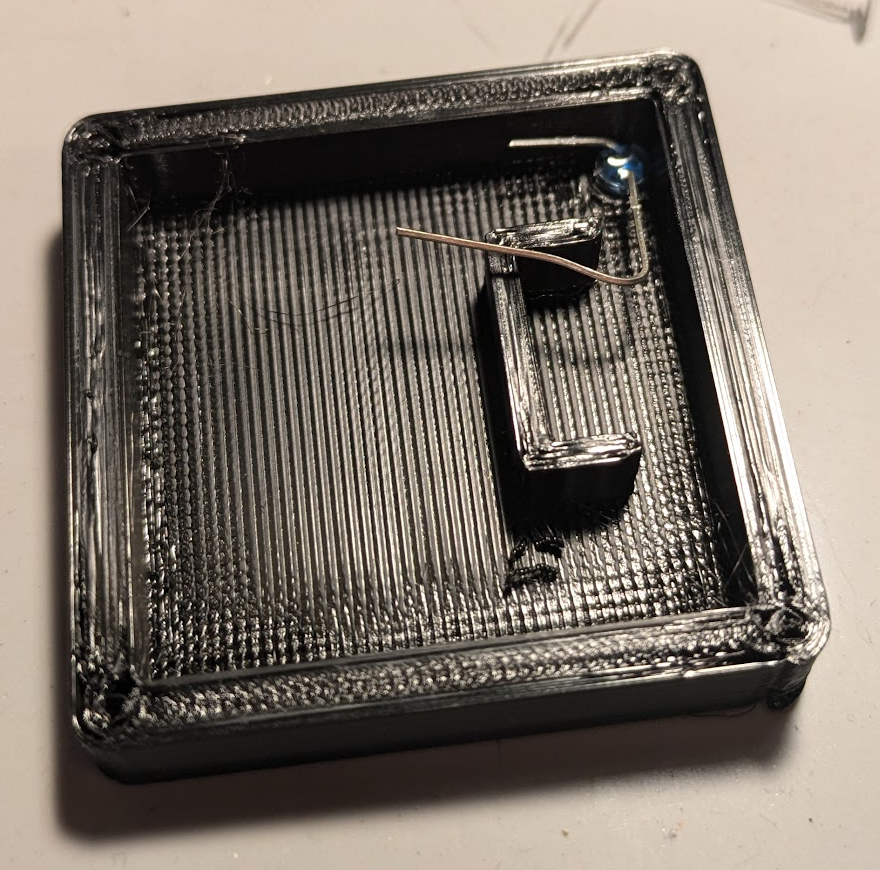

# 2 Square Base Notes

The files here are for printing bases for 2 square monsters.  The base
size is 45mm - this is actually slightly smaller than double the size
of standard 25mm (1 inch) base.  I made these slightly smaller because
these were still sufficiently large, but gave a little extra room for
the neighboring bases so made interacting with them a bit easier.

I used a FDM (PLA) printer to print these out - I expect they should also be
fine on resin (SLA) printers, as the models are not very complex.

A few added parts are needed for these bases:

- Small screws are used to secure the cover to the base.  I found this
  made disassembly and reassembly easier in the case something went
  wrong.  I used 1/4" (2.5x6 mm) screws.   I found some on amazon,
  though I suspect these can be found fairly easily.  100 screws was
  less than $7, so add a fairly minor cost to each base.
  
- As the base is large enough, I used battery holders for the CR2032
  battery.  The ones I got have an on/off switch integrated into the
  battery holder.  This is not needed in the case of the bases with the
  side switch, but if making bases with the bottom spring switch, you
  likely want a way to turn them off when not in use.  20 battery
  holders were less than $10.  While making bases with cutout to hold a
  battery is possible, I could never get 100% reliable connections - I
  might make a base, it tests out fine, and then when it came time to
  use it at the game, the connection stopped working.  Again, for a
  fairly minor increase in price, I liked the increased reliability.
  
- If making the weight activated bases, hinge micro switches are
  needed.  I got SPDT NO+NC hinge lever micro limit switches - the
  sizes is 12.6 mm long x 5.7 wide x 6.5 tall (not including hinge).
  the SPDT switches have 3 prongs - one is normally open and closes
  when pushed down and the other is normally closed and opens when
  pushed down (the ones used in this case).

- For the weight activated bases, extra weight so the hinge switch
  closes when pressed down is necessary.  Steel (lead free) tire
  weights are cheap, already have adhesive, and are magnetic so work
  well for this.  More notes on the weight activated bases below.
  

## Side Switch Assembly Instructions

Assembly of these bases is fairly close to that of the [DIY Build
Instructions](https://materialfoundry.github.io/MaterialPlane/DIY/BuildInstructions/)
with some extra notes since a battery holder is being used.

1. The side mount pushbutton switch uses the **45mm_base.stl** and
   **45mm_base_cover.stl** files.
   
1. Depending on exact switch, precision of printing, and other
   factors, it may be helpful to bend in the side leads of the switch
   so they do not stick out.  It may also be necessary to smooth out
   the edges or bottom of switch opening with a file or sharp knife.
   Glue the switch in place as per normal build.
   
   
   
1. The leads from the battery holder are much longer than needed.
   Position the battery holder and cut the leads a little bit longer
   than needed.  The black lead will go directly to the LED, and the
   red to the far side of the switch.  It is better to be too long
   than too short - there is space in the case to tuck any extra
   length of wiring.  Strip the end of the wires - it is a good idea
   to hold the wire you are stripping with pliers so you do not pull it
   out of the battery housing, ruining it.
   
1. Bend the long (anode) lead of the LED to the close switch contact,
   and cut it to length.  Bend the short (cathode) lead of the LED
   towards the battery holder and cut it - exact length is not as
   important, as long as the black wire from the battery holder can
   reach it.
   
1. Tinning all the contacts makes assembly a bit easier.  Tinning is
   just applying enough solder to get a thin coating.  Once things are
   tinned, then when connecting things, you probably don't need to apply
   any more solder.  Solder the contacts.  Note that if it is easier, the
   battery holder does not need to be in place when doing this - it
   can be hanging out of the base.
   
1. Insert a battery into the battery holder, and make sure the switch
   for the battery holder is in the on position.  Put the battery
   holder into the base and tuck the wires out of the way.
   
   
   
1. Before assembling the base, very that everything works.  You can
   use the material plane sensor for this - you just want to make sure the
   LED is emitting, but most webcams will also see the IR light, so I
   find it easier to just point it at the webcam on my computer.
   
1. The screw holes on the bottom plate may need a little cleanup - sharp craft
   knife again can be used to clean up the holes.  Line up the bottom
   plate to the rest of the base, hold the two together so the screws
   do not force them apart, and gently screw the screws in.  Do not
   over tighten the screws - they only need to be tight enough to hold
   everything together - there is not any force otherwise between the
   bottom plate and the base.  Over tightening will likely strip out
   the holes on the base itself.  If using these bases on an easily
   scratched surface, you will likely want to put felt on the bottom
   so the screws do not scratch the surface.  You might just be able
   to skip the bottom plate all together and apply felt to the base,
   but I have not tested that.

   

## Weight Activated Bases

The idea behind the weight activated bases is that when they are
sitting on the table, the switch will be in the open (not passing
current) position, and when lifted off the table, the switch closes,
and the LED lights up.

For the weight activated bases, the power switch for the battery
holder is exposed on the bottom of the base so it can be toggled.
This is really for when they are not being used, as without sufficient
weight, the LED will activate and burn the battery down.  One could
stack all the bases on top of each other and then put something heavy
(doesn't need to be very heavy) to push all the switches down.

How well these work will depends on a few factors:

- The weight of the figure.  The base, just by itself, is not heavy
  enough to trigger the switches I got, but most larger figures may be
  heavy enough to trigger them, especially if you are using metal
  figures.
  
- How much give is there in the surface the figures will be used on.
  In my case, by TV is covered with a polycarbonate sheet, so has
  minimal give.  As there is an exposed metal hinge on the switch, I
  would not recommend using these directly on a TV, as it will likely
  scratch it.
  
- Additional weight can be added to the base - this may be in the
  means a heavy metal plate for the magnet on the base of the figure
  to connect to, but there is a balancing act in that the more weight
  added to the base, the strength of the bond between the figure and
  its magnet may be a limiting factor, unless you are willing to
  secure the magnets permanently to the figure.  Most temporary
  adhesives are not as powerful as permanent ones, though using non
  adhesive (rubber bands) to strap the magnets to the figure might
  work.  With neodymium magnets, the magnet should be more than strong
  enough to left a base with added weight.

## Weight Switch Assembly Instructions

Assembly of these bases is fairly close to that of the [DIY Build
Instructions](https://materialfoundry.github.io/MaterialPlane/DIY/BuildInstructions/)
and directions above.

1. The spring mount base uses the **45mm_sp_base.stl** and
   **45mm_sp_cover.stl** files.  The cover for these have an extra
   opening so one can access the battery cover switch to turn these
   on/off, since when not in use, the lack of weight of a figure may
   cause them to turn on.
1. On the spring switch, bend all the leads to the side.  In the given
   picture, the leads are bent upwards and flat against the base of
   the switch.
   
   

1. The leads from the battery holder are much longer than needed.
   Position the battery holder and cut the leads a little bit longer
   than needed.  The black lead will go directly to the LED, and the
   red to the far side of the switch.  It is better to be too long
   than too short - there is space in the case to tuck any extra
   length of wiring.  Strip the end of the wires - it is a good idea
   to hold the wire you are stripping with pliers so you do not pull it
   out of the battery housing, ruining it.
1. The switches I'm using have a common, NO (normally open) and NC
   (normally closed) lead.  The connections for this setup are to the
   common and NC lead - these happen to be the two outside leads on
   this switch.  Bend the anode (long wire) of the LEd to where either
   the NC or common switch lead is, then cut to length.  The picture
   shows the lead before being cut to length.  Bend the lead back on
   itself a little bit to where the switch connector will be - it is
   impossible to assemble with the switch in place, as the leads are
   not accessible, so a little wiggle room is needed.
   
   

   
1. Tinning all the contacts makes assembly a bit easier.  Tinning is
   just applying enough solder to get a thin coating.  Once things are
   tinned, then when connecting thing, you probably don't need to apply
   any addtional solder.
   
1. Solder everything together.  This is done outside of the base - the
   bent anode of the LED goes to the lead on the switch which is near
   the base of the spring switch.  The LED and spring switch should be
   facing opposite directions.  If necessary, put these in the base to
   make sure you have your orientation correct.  It is helpful to have
   something holding the switch as you solder onto it - in the
   picture, this is an alligator clip.
   
   
   
1. Insert a battery into the battery holder, and then tuck everything
   into the base.  Make sure the battery holder is in the off
   position, as otherwise the LED will activate and drain the
   battery.  You may need to bend the lead from the LED to position
   the switch properly.
   
   
   
1. Before assembling the base, very that everything works.  You can
   use the material plane sensor for this (just want to make sure the
   LED is emitting), but most webcams will also see the IR light, so I
   find it easier to just point it at the webcam on my computer.  Turn
   the switch on the battery holder to the on position - the IR led
   should activate (either seen by webcam or foundry).  Press in the
   spring switch - the LED should turn off.  Turn off the switch on
   the battery.  Note that I do not bother gluing the switch in
   place - the lead from the LED and cover work well enough for me to
   keep everything where it should be.
   
1. The screw holes on the bottom plate may need a little cleanup - sharp craft
   knife can be used to clean up the holes.  Line up the bottom
   plate to the rest of the base - the bigger open rectangle goes over the
   spring switch, the smaller one over the battery siwtch. Hold the
   two pieces together so the screws
   do not force them apart, and gently screw the screws in.  Do not
   over tighten the screws - they only need to be tight enough to hold
   everything together - there is not any force otherwise between the
   bottom plate and the base.  Over tightening will likely strip out
   the holes on the base itself.  Make sure the spring switch is
   operating smoothly - you might need to move it slightly to not hit
   the casing, which is one advantage of not gluing it in place.
   
   

1. Add weight.  The base itself is too light to activate the switch.
   If you are using old lead figures, these may weigh enough to
   activate the trigger, but it is simpler to just add weight so that
   even with no figure, the switch will trigger.  Make sure you don't
   cover up the LED.  I used steel
   adhesive tire weights - 4 weights (total of 1 ounce or 28 grams) is
   sufficient to cause it to work pretty reliably.  The switch emits an
   audible click, so one can easily know if it is working or not - if
   it still doesn't close with the weights, the weights may sufficient
   that if the base is pressed down, it won't spring back up.
   
   
   
1. To use, a small screwdriver, bent paperclip, etc, can be used to
   turn the battery switch on and off on the base.  While the extra
   weights should make it so that the LED will not be on when the base
   is in storage, if the base gets knocked to its side or upside down,
   the LED will now turn on, and given it is IR, one will not see this
   until you find it next time with a dead battery.  So when not in
   use, turn it off, when put onto the map, turn it on and it should
   be fine until it is removed from the map.  It should work such that
   when you pick up the figure, LED turns on, foundry will move the
   figure, and when you put it down, LED turns off.  One should make
   sure that foundry has the figure in the right space before putting
   it down and having the LED turn off.

  
Mark Wedel
mwedel@thetavernbbs.com
